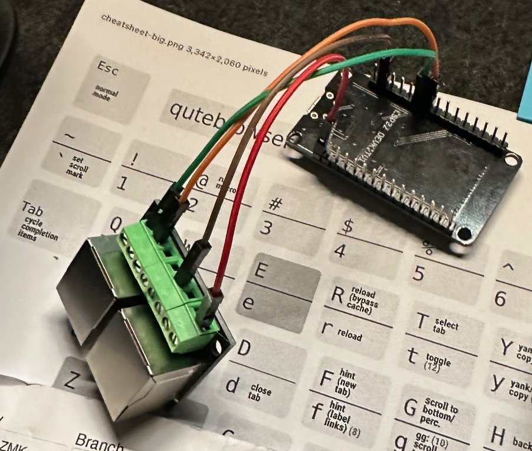
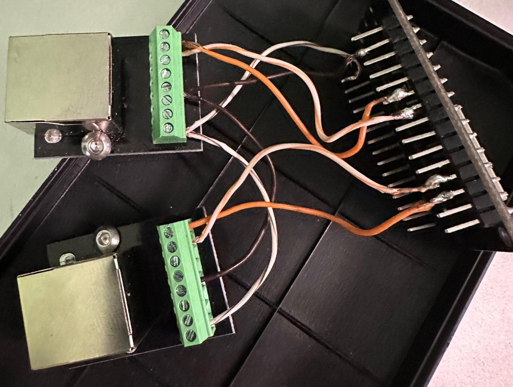
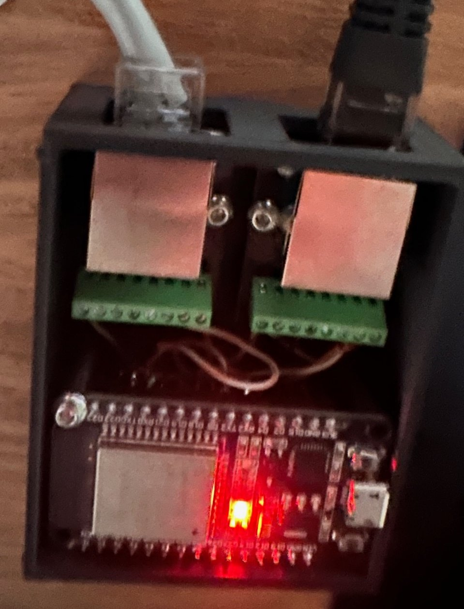
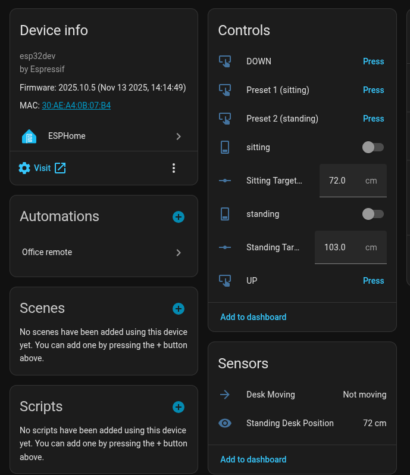

# Cheap Standing Desk Controller for Home Assistant

## Background

I ordered a cheap standing desk off [Amazon](https://www.amazon.co.uk/dp/B0DBHDKQT7), and after using it for a few days, the only logical thought any sane person would have is:

**“How can I connect this to Home Assistant”**

So, after hooking it up to a cheap [Logic Analyzer](https://www.amazon.co.uk/dp/B0D868ST5C) I realised:

1. Only four pins in the controller plug are actually doing anything.  
2. Two of them are just ground and 5V.  
3. Sniffing the remaining two with the logic analyzer revealed serial comms at a luxurious 9.6 kbps.  
4. The motor *also* has an unused I²C connection (which I will definitely poke later).

## It’s All Serial

After poking around with the logic analyzer, I discovered the motor basically sends the desk height in some cursed LCD segment encoding. Meanwhile, the controller sends just three main commands: **up**, **down**, and **idle** 
After pressing buttons and capturing enough serial traffic had enough info to wire up an ESP32.

### Protocol

#### Display

The display uses a strange 7-segment encoding, presumably designed by someone who enjoys puzzles.

| Hex  | Digit |
|------|--------|
| 0x3F | 0 |
| 0x06 | 1 |
| 0x5B | 2 |
| 0x4F | 3 |
| 0x66 | 4 |
| 0x6D | 5 |
| 0x7D | 6 |
| 0x07 | 7 |
| 0x7F | 8 |
| 0x6F | 9 |

#### Motor Control

| Hex | Command |
|-----|---------|
| 0xA5 0x00 0x00 0xFF 0xFF | idle |
| 0xA5 0x00 0x20 0xDF 0xFF | up |
| 0xA5 0x00 0x40 0xBF 0xFF | down |
| 0xA5 0x00 0x02 0xFD 0xFF | Preset 1 |
| 0xA5 0x00 0x04 0xFB 0xFF | Preset 2 |
| 0xA5 0x00 0x08 0xF7 0xFF | Preset 3 |
| 0xA5 0x00 0x01 0xFE 0xFF | M |

## Build

### Failure (my default working mode)

My original plan was to connect the ESP32 directly to the serial lines between the controller and motor using a simple [RJ45 breakout board](https://www.amazon.co.uk/Terminal-Breakout-Ethernet-Connector-Shielded/dp/B0CW1ML5C3).

| Use | RJ45 Pin | ESP Pin |
| ----| ---| ---|
| 5V | 1 | 5V |
| GND | 3 | GND |
| RX | 16 | 7 | 
| TX | 17 | 8 | 

Unfortunately, doing this absolutely *killed* the communication between the controller and the motor. So it was time for **Plan B**, also known as **“fine, I'll do it the complicated way.”**

### Win (if you ignore the soldering)

I ended up using *two* RJ45 breakout boards to create a full “man-in-the-middle” setup between the controller and the desk:

| Use | RJ45 Pin | ESP Pin |
| ----| ---| ---|
| 5V | 1 | 5V |
| GND | 3 | GND |
| RX Desk | 16 | 7 (Desk) | 
| TX Desk | 17 | 8 (Desk) | 
| RX Controller | 3 | 7 (Controller) |
| TX Controller | 1 | 8 (Controller) |

After creating this **abomination of solder and regret**, I needed an enclosure to hide the shame.

Finally, after wiring everything up, I created the world’s simplest ESPHome configuration so I could get this into Home Assistant:

Basically, the ESP32 forwards all traffic between the controller and the desk… until I decide *I* want control. Then it stops being polite and starts running the desk itself.

The code and STL for the enclosure are in their respective folders. You know where to look. Please note I literraly copied example esphome code, so it works but it's not amazing. 

This means that the controller works perfectly and I can controll it using Alexa, the Home Assistant app and a zigbee remote.

## Parts List

* [RJ45 breakout boards](https://www.amazon.co.uk/dp/B0F23DXK83)  
* [Cheap standing desk](https://www.amazon.co.uk/dp/B0DBHDKQT7)  
* [ESP32 development board](https://www.amazon.co.uk/ESP-32S-Development-2-4GHz-Bluetooth-Antenna/dp/B071JR9WS9)
